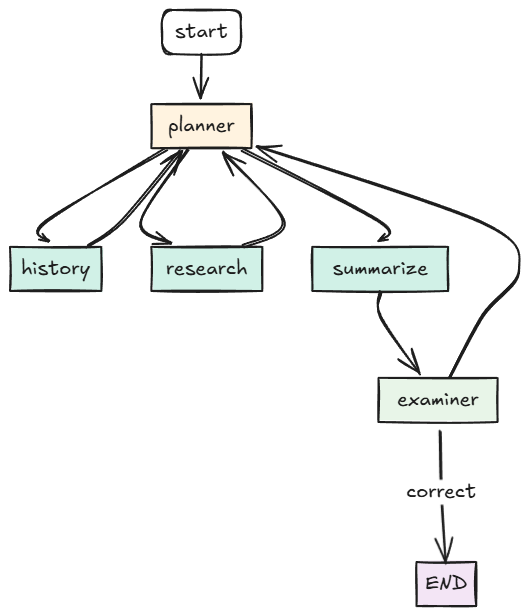

# LangGraph Research Agent with Conversation History

A research agent built with LangGraph that can conduct Wikipedia research and maintain conversation history across sessions.

## Features

- 🔍 **Intelligent Research**: Plans and conducts research using Wikipedia
- 💬 **Conversation History**: Maintains context across multiple queries within sessions
- 🧠 **Context-Aware**: Uses conversation history to provide more relevant answers
- 🔄 **Follow-up Questions**: Understands and answers related follow-up questions
- 📝 **Session Management**: Create, manage, and clear conversation sessions

## Quick Start

1. **Install dependencies**:
   ```bash
   pip install -r requirements.txt  # or use uv
   ```

2. **Set OpenAI API key**:
   ```bash
   export OPENAI_API_KEY=your_key_here
   ```

3. **Run the server**:
   ```bash
   python src/langgraph_test/app.py
   ```

4. **Test with example**:
   ```bash
   python examples/conversation_demo.py
   ```

## API Endpoints

### Main Query Endpoint

**POST `/query`**
- Send queries with optional session management
- Returns research results and conversation history

```json
{
  "query": "What is photosynthesis?",
  "session_id": "optional-session-id"
}
```

Response:
```json
{
  "query": "What is photosynthesis?",
  "summary": "Photosynthesis is the process...",
  "research_count": 2,
  "memory": [...],
  "status": "completed",
  "session_id": "uuid-session-id",
  "conversation_history": [...]
}
```

### Session Management

**GET `/sessions`**
- List all active sessions

**GET `/sessions/{session_id}/history`**
- Get conversation history for a specific session

**DELETE `/sessions/{session_id}`**
- Clear conversation history for a session

## How Conversation History Works

1. **Session Creation**: If no `session_id` is provided, a new one is automatically generated
2. **Context Awareness**: The planner considers previous conversations when planning research
3. **Persistent Storage**: Sessions are stored as JSON files in the `sessions/` directory
4. **Context Limits**: Uses last 3 conversations for planning, last 2 for summarizing

## Example Usage

### Basic Query (Creates New Session)
```python
import requests

response = requests.post("http://localhost:8000/query", json={
    "query": "What is machine learning?"
})
session_id = response.json()["session_id"]
```

### Follow-up Query (Same Session)
```python
response = requests.post("http://localhost:8000/query", json={
    "query": "How does it differ from deep learning?",
    "session_id": session_id
})
```

### Get Conversation History
```python
response = requests.get(f"http://localhost:8000/sessions/{session_id}/history")
history = response.json()["history"]
```

## Agent Workflow

 


## Configuration

The agent uses:
- **Model**: GPT-4.1-mini-2025-04-14 (configurable)
- **Temperature**: 0.2 for planning/examining, 0 for summarizing
- **Research Limit**: Auto-stops after 7+ research entries
- **Memory Limit**: Auto-stops after 12+ memory entries

## Development

### Project Structure
```
src/langgraph_test/
├── agent_builder.py      # Main graph construction
├── app.py               # FastAPI server with session management
├── nodes/
│   ├── planner_node.py   # Research planning with conversation context
│   ├── researcher_node.py # Wikipedia research
│   ├── summarizer_node.py # Context-aware summarization
│   ├── examiner_node.py  # Answer quality checking
│   ├── stopper_node.py   # Decision logic
│   └── state_agent.py    # State management with history
└── tools/
    └── wiki_tool.py      # Wikipedia search tool
```

### Running Tests
```bash
# Start the server
python src/langgraph_test/app.py

# Run the example conversation
python examples/conversation_demo.py

# Check health
curl http://localhost:8000/health
```

## Session Storage

Sessions are stored as JSON files in the `sessions/` directory:
```json
[
  {
    "query": "What is photosynthesis?",
    "summary": "Photosynthesis is the process by which...",
    "timestamp": "2024-01-15T10:30:00"
  }
]
```

## API Documentation

Visit `http://localhost:8000/docs` when the server is running for interactive API documentation.
